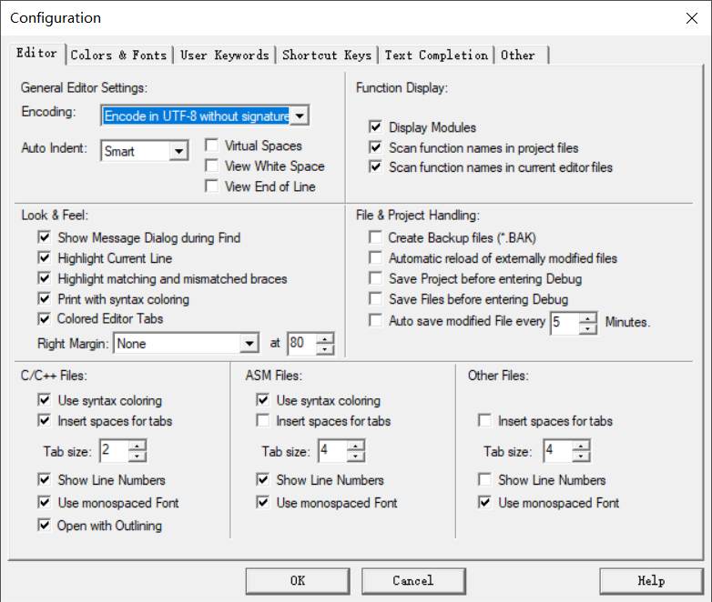
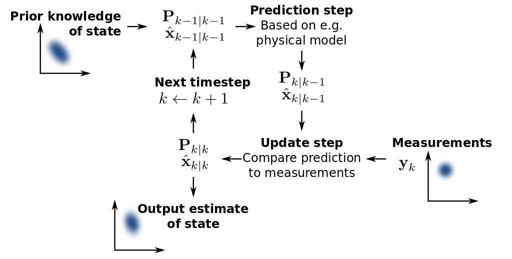
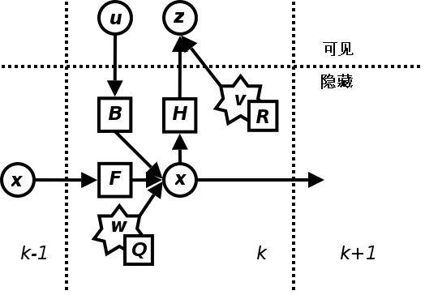

# Lib-kalman

嵌入式-卡尔曼滤波算法


## 目录

- [Lib-code](#lib-code)
- [目录](#目录)
- [快速入门](#快速入门)
  - [下载](#下载)
  - [Keil 设置](#keil-设置)
- [参考资料](#参考资料)
  - [卡尔曼滤波](#卡尔曼滤波)
    - [基本动态系统模型](#基本动态系统模型)
    - [卡尔曼滤波器](#卡尔曼滤波器)
- [维护者](#维护者)
- [许可证](#许可证)

## 快速入门

### 下载

 ```git
 git clone https://github.com/ChenxuanZhao/lib-kalman.git
 ```

### 目录说明

 ``` bash
├─Core       // 源码
│  ├─Inc     // 头文件
│  ├─Lib     // LIB 库
│  └─Src     // 源代码
├─Demo       // 例程
└─Lib-creat  // Lib 库创建
 ```

### Keil 工程设置

> Encoding: Encode in UTF-8 without signature



## 参考资料

### 卡尔曼滤波



卡尔曼滤波（Kalman filter）是一种高效率的递归滤波器（自回归滤波器），它能够从一系列的不完全及包含噪声的测量中，估计动态系统的状态。卡尔曼滤波会根据各测量量在不同时间下的值，考虑各时间下的联合分布，再产生对未知变数的估计，因此会比只以单一测量量为基础的估计方式要准。

#### 基本动态系统模型

卡尔曼滤波建立在线性代数和隐马尔可夫模型（hidden Markov model）上。其基本动态系统可以用一个马尔可夫链表示，该马尔可夫链建立在一个被高斯噪声（即正态分布的噪声）干扰的线性算子上的。系统的状态可以用一个元素为实数的向量表示。随着离散时间的每一个增加，这个线性算子就会作用在当前状态上，产生一个新的状态，并也会带入一些噪声，同时系统的一些已知的控制器的控制信息也会被加入。同时，另一个受噪声干扰的线性算子产生出这些隐含状态的可见输出。

为了从一系列有噪声的观察数据中用卡尔曼滤波器估计出被观察过程的内部状态，必须把这个过程在卡尔曼滤波的框架下建立模型。也就是说对于每一步k，定义矩阵$F_{k}, H_{k}, Q_{k}, R_{k}$，有时也需要定义$B_k$，如下。



卡尔曼滤波器的模型。圆圈代表向量，方块代表矩阵，星号代表高斯噪声，其协方差矩阵在右下方标出。
卡尔曼滤波模型假设k时刻的真实状态是从$(k − 1)$时刻的状态演化而来，符合下式：

$$ x_{k} = F_{k} x_{k-1} + B_{k} u_{k} + w_{k} $$

其中:

> $F-{k}$ 是作用在$x_{k−1}$上的状态变换模型。
  $B_{k}$ 是作用在控制器向量$u_{k}$上的输入－控制模型。
  $w_{k}$是过程噪声，并假定其符合均值为零，协方差矩阵为$Q_{k}$的多元正态分布。

时刻$k$，对真实状态$x_{k}$的一个测量$z_{k}$满足下式：

$$ z_{k} = H_{k} x_{k} + v_{k} $$

其中Hk是观测模型，它把真实状态空间映射成观测空间，vk是观测噪声，其均值为零，协方差矩阵为Rk,且服从正态分布。

$$ v_{k} \rightarrow N(0, R_{k}) $$

初始状态以及每一时刻的噪声{$x_{0}$, $w_{1}$, ..., $w_{k}$, $v_{1}$ ... $v_{k}$}都认为是互相独立的。

#### 卡尔曼滤波器

卡尔曼滤波是一种递归的估计，即只要获知上一时刻状态的估计值以及当前状态的观测值就可以计算出当前状态的估计值，因此不需要记录观测或者估计的历史信息。卡尔曼滤波器与大多数滤波器不同之处，在于它是一种纯粹的时域滤波器，它不需要像低通滤波器等频域滤波器那样，需要在频域设计再转换到时域实现。

卡尔曼滤波器的状态由以下两个变量表示：

> $ \hat{x}_{k|k} $ 在时刻k的状态的估计；
  $ P_{k|k} $ ，后验估计误差协方差矩阵，度量估计值的精确程度。
卡尔曼滤波器的操作包括两个阶段：预测与更新。在预测阶段，滤波器使用上一状态的估计，做出对当前状态的估计。在更新阶段，滤波器利用对当前状态的观测值优化在预测阶段获得的预测值，以获得一个更精确的新估计值。

##### 预测

$$ \hat{x}_{k|k-1} = F_{k} \hat{x}_{k-1|k-1} + B_{k} u_{k} $$

$$ P_{k|k-1} = F_{k} P_{k-1|k-1} F^{T}_{k} + Q_{k} $$

##### 更新

首先要算出以下三个量：

  测量残差，measurement residual

  $$ \widetilde{y}_{k} = z_{k} - H_{k} \hat{x}_{k|k-1} $$

  测量残差协方差

  $$ S_{k} = H_{k} P_{k|k-1} H^{T}_{k} + R_{k} $$

  最优卡尔曼增益

  $$ H_{k} = P_{k|k-1} H^{T}_{k} S^{-1}_{k}$$

然后用它们来更新滤波器变量x与P：

  更新的状态估计

  $$ \hat{x}_{k|k} = \hat{x}_{k|k-1} + K_{k} \widetilde{y}_{k} $$

  更新的协方差估计

  $$ P_{k|k} = (I - K_{k} H_{k}) P_{k|k-1} $$

使用上述公式计算$P_{k|k}$仅在最优卡尔曼增益的时候有效。

## 维护者

 [Chenxuan Zhao](https://github.com/ChenxuanZhao)

## 许可证

 [Apache License](LICENSE)  
 Copyright (c) 2020 Kiyotaka
